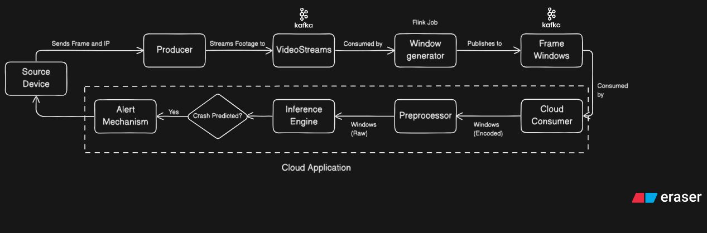

# 🚦 Video Crash Prediction Pipeline  

This project is a **real-time crash prediction system** that consumes video frames from Kafka, processes them with a Hugging Face model, and issues alerts back to the video source when a potential crash is detected.  

---

## 🔹 Features  
- 📡 **Kafka Integration**: Ingests video frame batches from Confluent Cloud Kafka (`VideoStreamProcessed` topic).  
- 🤖 **Crash Prediction**: Uses [VideoMAE v2](https://huggingface.co/zhiyaowang/VideoMaev2-giant-nexar-solution) for frame-level crash detection.  
- ⚡ **Real-Time Processing**: Works on frame windows (e.g., 16 frames per key).  
- 🔔 **Alerting**: Connects to the video source via socket (key provided in Kafka message) to trigger alerts when a crash is detected.  
- ☁️ **Cloud Ready**: Designed to run with Confluent Kafka + Hugging Face models.  

---

## 🔧 Tech Stack  
- **Python 3.9+**  
- **Confluent Kafka Python client** (`confluent-kafka`)  
- **Hugging Face Transformers / Diffusers**  
- **PyTorch**  
- **Sockets** (for alert communication)  

---

## 🔄 Pipeline



---

## 📂 Project Structure  
```bash
video-crash-prediction-pipeline/
├── inference.py       # Kafka consumer + model inference + alerting
├── client.py          # (Optional) For testing: pushes mock video frames into Kafka
├── flink.sql          # Flink SQL queries
├── requirements.txt   # Python dependencies
└── README.md          # Project documentation
